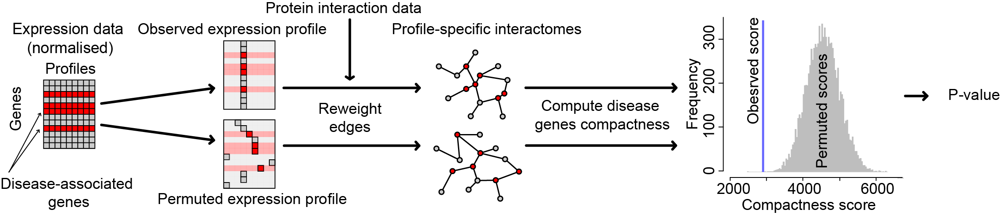

<!--
%\VignetteEngine{knitr::knitr}
%\VignetteIndexEntry{Knitr and DiseaseCellTypes}
-->
````{r setup, echo=FALSE}
options(width = 75)
options(useFancyQuotes=FALSE)
```
```{r hook-printfun, echo=FALSE}
library(knitr)
library(formatR)
knit_hooks$set(printfun = function(before, options, envir) {
    if (before) return()
    txt = capture.output(dump(options$printfun, '', envir = envir))
    ## reformat if tidy=TRUE
    if (options$tidy)
        txt = tidy.source(text=txt, output=FALSE, width.cutoff=30L, keep.comment=TRUE, keep.blank.line=FALSE)$text.tidy
    paste(c('\n```r\n', txt, '\n```\n'), collapse="\n")
})
```


# Vignette for DiseaseCellTypes
#### Alex J. Cornish
## Introduction

This vignette explains how to use the **DiseaseCellTypes** package to identify disease-cell type associations and reproduce the results of Cornish et al. (2015).

Two methods are implemented within the **DiseaseCellTypes** package: 
- Gene set compactness (GSC)
- Gene set overexpression (GSO)

The performance of these two methods is analysed in Cornish et al. (2015). The code contained within this vignette, along with the data provided within the **DiseaseCellTypes** package, allows users to reproduce the results of Cornish et al. (2015). Due to the time required to reproduce the results in full, some of this code is commented out. However, it can be uncommented and run as required.


## Overview of the GSC method
The GSC method identifies cell types associated with diseases by comparing the clustering of disease-associated genes across cell type-specific interactomes. While only associations between diseases and cell types are identified in this vignette, the GSC method can also be used to identify associations with other biological entities, such as tissues. 

The GSC method is based on the compactness function; defined by Glaab et al. (2010) as the mean distance between pairs of vertices in a set of vertices on a graph. Through a permutation-based approach, it is possible to use the compactness score to identify networks within which sets of vertices cluster (Cornish et al. 2014). Here we use random walks with restart (RWR, Kohler et al. 2008) to compute distances between vertex pairs.

Cell type-specific interactomes are created by integrating expression data with protein-protein interaction (PPI) data. Edges are re-scored using the product of the percentile-normalised relative expression scores. In this vignette, we use gene expression data from  the FANTOM5 project (Forrest et al. 2014), PPI data from the STRING database (Franceschini et al. 2013) and disease-gene associations from the DisGeNET database (Bauer-Mehren et al. 2010). 

A cell type-specific interactome is created for each of the cell types. These are referred to as the observed interactomes. In order to determine whether a disease-associated gene set is more compact in each observed interactome than expected by chance, permuted interactomes are created by permuting the percentile-normalized expression scores and using these scores to create permuted interactomes. The compactness score of the disease-associated gene set is computed for each observed and permuted interactome and an empirical p-value produced by counting the number of permuted scores smaller than each observed score. 




## Guide to identifying disease-cell type associations
In this section, we will describe how to transform raw gene expression values to percentile-normalized relative gene expression scores, create a global interactome using the **igraph** package (Csardi et al. 2006) and identify disease-associated cell types using the GSC and GSO methods.


### Creating the global interactome
The PPI data used by the GSC method should be in the format of an **igraph** object. Gene names should be present under the vertex attribute **name**. It is not necessary to create the cell type-specific interactomes to run the GSC method, as they are created within the **gene.set.compactness** function. However, cell type-specific interactomes can be created separately using the **score.edges** function for other uses.

```{r create_network}
# for reproducibility
set.seed(1)

# load DiseaseCellTypes package
require(DiseaseCellTypes)

# load PPI data
data(edgelist.string)
edgelist.string[1:3, ]

# create igraph object
g <- graph.edgelist(as.matrix(edgelist.string[, c("ID.A", "ID.B")]), directed=FALSE)
```


### Normalizing the gene expression values
Before running the GSC or GSO methods, it is necessary to produce a matrix of percentile-normalized relative gene expression scores. Each row in this matrix should represent a gene and each column a cell type. 

The FANTOM Consortium make their gene expression data available for download. This data is provided as expression counts for transcription start sites (TSS), rather than genes. We have converted the TSS-wise expression values to gene-wise values by summing the scores of the TSSs associated with each gene (Sardar et al. 2014). This data has been saved within the **DiseaseCellTypes** package. 

We will now use the **expression.transform** function to transform the expression values to percentile-normalized relative expression scores. 

```{r transform_expression}
# load FANTOM5 gene expression data
data(expression.fantom5)
expression.fantom5[1:3, 1:2]

# transform to percentile-normlized relative gene expression scores
expression <- expression.transform(expression.fantom5)
expression[1:3, 1:2]
```


### Loading the disease-associated genes
The **DiseaseCellTypes** package contain disease-gene associations from the DisGeNET database. 

```{r disease_genes}
# load disease-gene associations
data(disease.genes)
disease.genes[["uveitis, anterior"]]
```


### Running the GSC method
We will now apply the GSC method to genes known to be associated with bipolar disorder. The code is commented out due to the time required to run.

```{r gsc}
# identify cell types associated with panic disorder-
disease <- "bipolar disorder"
genes <- disease.genes[[disease]]

# remove genes not contained within the network
genes <- genes[genes %in% V(g)$name]

# run the gene set compactness function
#res.gsc <- gene.set.compactness(expression, genes, g, n.perm=100)
```

The results have been saved within the package.

```{r gsc_load}
# load the previously-computed results
data(res.gsc)
```

Each p-value contained within the **dct** object output by the **gene.set.compactness** function represents the likelihood of observing clustering at least as strong as that observed, given the PPI data and that the cell type is not associated with the disease. 

The observed scores can be compared to the permuted scores by plotting the **dct** object. The gray histogram represents the distribution of the permuted scores. The red lines represent the observed scores of cell types with p-values less than a given cutoff. By default, this cutoff is **0.05**. When using these results, p-values should be adjusted for multiple testing. The p-values output by the **gene.set.compactness** have not been adjusted.

```{r gsc_investigate, results="asis"}
# look at the p-value of the neuron
res.gsc$pval[["neuron"]]

# plot the results to compare permuted and observed scores
plot(res.gsc)
```


### Running the GSO method
The GSO method is similar to the GSC method, although it does not use cell type-specific interactomes and instead identifies cell types in which the mean expression of the disease-associated genes is higher than expected by chance. Like the GSC method, the GSO method computes an empirical p-value by permuting the gene expression scores and comparing the observed mean expression score of the disease-associated genes to the distribution of permuted mean expression scores.

Here we will apply the GSO method to the gene expression data and disease-associated genes used in the previous section. 

```{r gso}
# run the GSO method
res.gso <- gene.set.overexpression(expression, genes, n.perm=100)
```

Like the **gene.set.compactness** results, we can plot the results of the **gene.set.overexpression** function to compare the observed and permuted mean expression scores. 

```{r gso_investigate, results="asis"}
# look at the p-value of the neuron
res.gso$pval[["neuron"]]

# plot the results to compare permuted and observed scores
plot(res.gso)
```


## Creating cell type-specific interactomes
Cell type-specific interactomes are created using the **score.edges** function. In this example, we will create a neuron-specific interactome: 

```{r create_neuron_interactome}
# create global network
data(edgelist.string)
g <- graph.edgelist(as.matrix(edgelist.string[, c("ID.A", "ID.B")]), directed=FALSE)

# load and transform expression data
data(expression.fantom5)
expression <- expression.transform(expression.fantom5)

# create neuron-specific interactome
g.neuron <- score.edges(g, expression[, "neuron"])
```

By default, the edge weights are saved under the edge attribute **score** and the gene expression scores under the vertex attribute **expression**. 

```{r monocyte_interactome_attributes}
# edge scores
E(g.neuron)$score[1:5]

# vertex expression scores
V(g.neuron)$expression[1:5]
```


## Guild to recreating the results of Cornish et al. (2015)
The data required to recreate the results (gene expression data from the FANTOM5 project, PPI data from the STRING database and disease-gene associations from the DisGeNET database) are contained within the **DiseaseCellTypes** package. It has not been possible to include the code required to reproduce the results of the text-mining. However, further details about how to recreate results of the text-mining can be obtained by e-mailing the author of this vignette (**a.cornish12 at imperial.ac.uk**). The results of the text-mining are included within the package.


### Large scale mapping of diseases to cell types
Both the GSC and GSO method were used to identify the disease-associated cell types. This section contains the code required to rerun this analysis. It is commented out due to the time required to rerun the code.

```{r recreate_gsc_gso}
# # parameters 
# min.n.genes <- 6 # minumum number of genes for a disease to be tested
# n.perm <- 10000 # number of permutations
# rwr.r <- 0.7 # the RWR restart probability  
# rwr.cutoff <- 1e-5 # the RWR iteration termination cutoff
# parallel <- 4 # the number of cores to use 
# 
# # load and create global network
# data(edgelist.string)
# g <- graph.edgelist(as.matrix(edgelist.string[, c("ID.A", "ID.B")]), directed=FALSE)
# genes.g <- V(g)$name
# 
# # load and format gene expression data
# data(expression.fantom5)
# expression <- expression.transform(expression.fantom5)
# genes.expression <- rownames(expression)
#  
# # load disease-associated genes
# data(disease.genes)
# disease.genes <- sapply(disease.genes, function(genes) genes[genes %in% genes.g], simplify=F) # remove disease-associated genes not found in network or expression
#
# # select diseases with at least min.n.genes associated genes
# disease.genes <- disease.genes[sapply(disease.genes, length) >= min.n.genes]
# diseases <- names(disease.genes)
# 
# # for each disease, apply the GSC method
# pvalues.gsc <- t(sapply(diseases, function(disease) gene.set.compactness(expression, disease.genes[[disease]], g, n.perm, rwr.r=rwr.r, rwr.cutoff=rwr.cutoff, parallel=parallel)$pval))
# 
# # for each disease, apply the GSO method
# pvalues.gso <- t(sapply(diseases, function(disease) gene.set.overexpression(expression, disease.genes[[disease]], n.perm)$pval))
```

The results produced using this script were used in the accompanying paper and are saved within the package. We will now load these results and produce a heatmap showing the associations. Here, for simplicity, we will include only 10 diseases and cell types.

```{r setup_heatmap, results="asis"}
# load the associations
data(pvalues.gsc)

# compute the -log10 of the p-values
pvalues.ml10 <- -log10(pvalues.gsc)

# plot heatmap
require(gplots)
n.cols <- 500
cols <- colorRampPalette(c("#D3DDDC", "#02401B"))(n.cols)
col.breaks <- c(0, seq(-log10(0.05), max(pvalues.ml10), length.out=n.cols))
heatmap.2(pvalues.ml10[1:10, 1:10], Rowv=TRUE, Colv=TRUE, dendrogram="both", breaks=col.breaks, col=cols, notecol="black", trace="none", margins=c(18,15), key=TRUE, density.info="none")
```


### Comparing the GSC and GSO associations with text-mined associations
Next, we will compare the associations identified using the GSC and GSO methods with the associations identified using text mining. Since the text-mining identifies cell types affected by a disease, as well as cell types causing a disease, these associations cannot be considered gold standards. In Cornish et al. (2015), we show that the GSC method works best for diseases with 6 or more associated genes. For this reason, we remove diseases with fewer associated genes.

```{r load_pvalues}
# load the associations
data(pvalues.gsc)
data(pvalues.gso)
data(pvalues.text)

# keep associations for diseases with 6 or more associated genes
data(disease.genes)
diseases <- names(disease.genes)[sapply(disease.genes, length) >= 6]
pvalues.gsc <- pvalues.gsc[diseases, ]
pvalues.gso <- pvalues.gso[diseases, ]
pvalues.text <- pvalues.text[diseases, ]
```

We next adjust the p-values using the Benjamini-Hochberg (BH) procedure for multiple testing:

```{r adjust_pvalues}
# adjust p-values for multiple testing
pvalues.adj.gsc <- array(p.adjust(as.vector(pvalues.gsc), method="BH"), dim=dim(pvalues.gsc), dimnames=dimnames(pvalues.gsc))
pvalues.adj.gso <- array(p.adjust(as.vector(pvalues.gso), method="BH"), dim=dim(pvalues.gso), dimnames=dimnames(pvalues.gso))
pvalues.adj.text <- array(p.adjust(as.vector(pvalues.text), method="BH"), dim=dim(pvalues.text), dimnames=dimnames(pvalues.text))
```

We can then compare the association overlap at a false discovery rate (FDR) of 10%:

```{r compare_associations}
# count the number of associations supported by text
res <- matrix(NA, 2,2, dimnames=list(c("supported", "not supported"), c("GSO", "GSC")))
cutoff <- 0.10
res["supported", "GSO"] <- sum(pvalues.adj.gso <= cutoff & pvalues.adj.text <= cutoff)
res["supported", "GSC"] <- sum(pvalues.adj.gsc <= cutoff & pvalues.adj.text <= cutoff)
res["not supported", "GSO"] <- sum(pvalues.adj.gso <= cutoff & !pvalues.adj.text <= cutoff)
res["not supported", "GSC"] <- sum(pvalues.adj.gsc <= cutoff & !pvalues.adj.text <= cutoff)
res
```


### Creating the cell type diseasome
We are able to create a cell type-based diseasome using the disease-cell type associations identified. This is done by measuring the correlation between pairs of diseases, with respect to the -log10 of their cell type association p-values, then connecting each disease to the diseases with which it correlates most strongly. In Cornish et al. (2015), we chose to connect each disease to the four diseases with which it correlated most strongly, to aid in the visual interpretation of the diseasome. However, other values can also be used.

In order to visualise the clustering of similar diseases, we colour diseases by their disease class, obtained from the MeSH databases and saved within the package.

```{r diseasome, results="asis"}
# load the disease classes
data(disease.classes)

# diseases to set colours for
disease.cols <- c("Cardiovascular Diseases", "Digestive System Diseases", "Immune System Diseases", "Mental Disorders", "Nervous System Diseases", "Nutritional and Metabolic Diseases", "Respiratory Tract Diseases", "Skin and Connective Tissue Diseases", "Urogenital Diseases and Pregnancy Complications")
col.other <- "white"

# set colour for each disease class
classes <- sort(unique(disease.classes))
cols <- rep(col.other, length(classes))
names(cols) <- classes
for (i in 1:length(disease.cols)) cols[disease.cols[i]] <- rainbow(length(disease.cols))[i]

# identify the class color for each disease
disease.cols <- cols[disease.classes]
names(disease.cols) <- names(disease.classes)

# create the diseasome
project.network(pvalues.adj.gsc[names(disease.cols), ], col.vert=disease.cols, col.other=col.other, vert.size.max=5, vert.label.cex=0.6, edge.width.max=5, layout=layout.fruchterman.reingold) 
project.network.legend(cols, col.other)
```


### Extracting a cell type-specific disease gene subgraph
In this section, we will extract a subgraph of psoriasis-associated genes from a monocyte-specific interactome. This will include the psoriasis-associated genes and their interacting partners. We first construct the monocyte-specific interactome. 

```{r create_monocyte_interactome}
# create global network
data(edgelist.string)
g <- graph.edgelist(as.matrix(edgelist.string[, c("ID.A", "ID.B")]), directed=FALSE)

# load expression data
data(expression.fantom5)
expression <- expression.transform(expression.fantom5)

# create monocyte-specific interactome
g.monocyte <- score.edges(g, expression[, "monocyte"])
```

Next, we identify the psoriasis-associated genes. To aid in visual interpretation of the subgraph, psoriasis-associated genes more than 15 interacting partners are excluded.

```{r identify_disease_genes}
# identify all psoriasis-associated genes
data(disease.genes)
psoriasis.genes <- disease.genes[["psoriasis"]]

# remove genes not present in the network
psoriasis.genes <- psoriasis.genes[psoriasis.genes %in% V(g.monocyte)$name]

# remove genes with more than 15 interacting partners
psoriasis.genes <- psoriasis.genes[degree(g.monocyte)[psoriasis.genes] <= 15]
```

We can now use the **disease.subgraph** function to produce a monocyte-specific psoriasis subgraph. 

```{r psoriasis_subgraph}
# produce psoriasis subgraph
g.subgraph <- disease.subgraph(g.monocyte, psoriasis.genes, n.bins=500, edge.width.max=10)
plot(g.subgraph)
```

In this plot, edges are weighted and coloured by their score, so that edges that are more likely to occur in monocytes are thick and dark blue. Vertices are coloured by the expression score of their respective gene, so that genes that are highly overexpressed in monocytes are coloured black. Square vertices represent disease genes and circle vertices represent their interacting partners.

In this plot, many of the disease-associated genes are strongly connected by monocyte-upweighted interactions, suggesting a pathway through which they may affect the development of the disease in monocytes. 


## Session information
This document was produced using:

```{r session_info}
sessionInfo()
```


## References
Bauer-Mehren A, Rautschka M, Sanz F, Furlong LI (2010) DisGeNET: a Cytoscape plugin to visualize, integrate, search and analyze gene-disease networks. Bioinformatics 26(22):2924-2926.

Cornish AJ, Markowetz F (2014) SANTA: Quantifying the Functional Content of Molecular Networks. PLoS Comput Biol 10(9):e1003808.

Cornish AJ, Filippis I, David A and Sternberg MJE (2015) Exploring the cellular basis of human disease through a large-scale mapping of deleterious genes to cell types. (Under Revision)

Csardi G, Napusz T (2006) The igraph software package for complex network research. Inter Journal Complex Systems p. 1695.

Forrest ARR et al. (2014) A promoter-level mammalian expression atlas. Nature 507(7493):462-470.

Franceschini A et al. (2013) STRING v9.1: protein-protein interaction networks, with increased coverage and integration. Nucleic Acids Res 41:D808-D815.

Glaab E, Baudot A, Krasnogor N, Valencia A (2010) Extending pathways and processes using molecular interaction networks to analyse cancer genome data. BMC Bioinformatics 11:597.

Kohler S, Bauer S, Horn D, Robinson P (2008) Walking the interactome for prioritization of candidate disease genes. Am J Hum Genet 82:949-958.

Sardar AJ et al. (2014) The evolution of human cells in terms of protein innovation. Mol Biol Evol 31(6):1364-1374.
